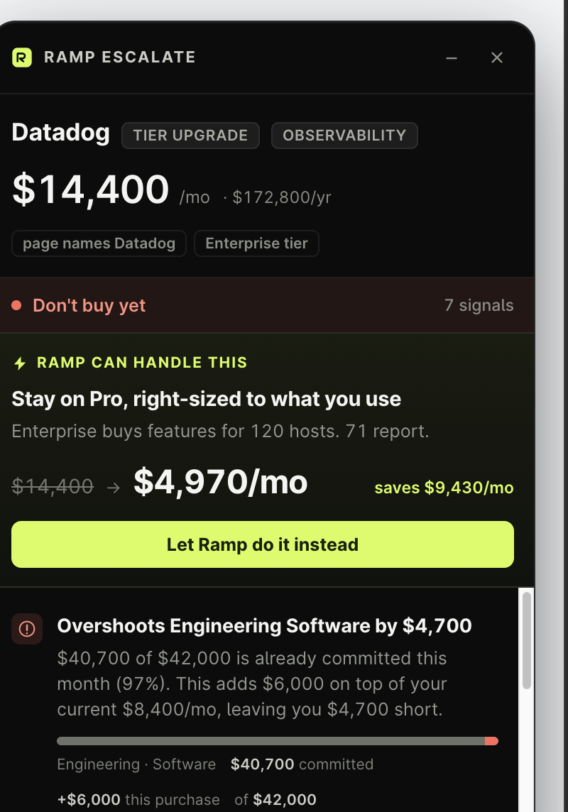

# Ramp Escalate

A Chrome extension that reads the page an employee is on, works out what they're
about to spend, and checks it against Ramp's ledger **before** the money moves —
not after it lands in an expense report.

Most spend tooling is retrospective, and a card extension only wakes up at the
checkout field. Escalate sits upstream: it watches a pricing page, a cloud console
or a booking flow the way a finance partner looking over your shoulder would, and
says the useful thing while you can still act on it.



## Demo in 45 seconds

Run one scenario. The Datadog one carries the whole story.

| | |
|---|---|
| **0:00** | Engineer is upgrading Datadog Pro → Enterprise. The panel appears on its own — nobody opened anything. |
| **0:08** | `$14,400/mo` — the same number the page shows. **Don't buy yet.** |
| **0:15** | Overshoots the Engineering software budget by $4,700, and New Relic already does observability. |
| **0:25** | **Let Ramp do it instead** → buy Enterprise, but for the 71 hosts that still report rather than all 120. $14,400 → $8,520. |
| **0:35** | PENDING — the steps tick in over a second: Enterprise provisioned at 71 hosts, card issued and capped, budget cleared, Finance sign-off queued. |
| **0:40** | The invoice button lightens. **View invoice** → $8,520.00 due, $5,880.00 avoided — and the tier they wanted costs $120/mo more, not $6,000. |

If you have the room, the **Ask Ramp** box at the bottom is the best objection-handler
in the demo. Type something like *"the platform sub-team needs all 120 hosts for the
Q4 migration"* and Ramp doesn't dig in — it checks the host tags, concedes the point,
and offers Enterprise on all 120 for **90 days, reverting to 71 on 2027-01-09**, with
the Finance sign-off it needs. One button routes it. Ramp as a negotiator with an
expiry date, not a blocker.

The panel leads with two signals and hides the rest behind *Show N more* — the
depth is there if a judge asks, and out of the way if they don't.

## Run it

```bash
python3 -m http.server 8787     # from the repo root — serves the demo pages
```

1. `chrome://extensions` → **Developer mode** on → **Load unpacked** → pick this folder.
2. Open <http://localhost:8787/demo/index.html> and click through the four scenarios.
3. Watch the bottom-right corner, and the toolbar badge.

The demo pages also run standalone — if the extension isn't loaded, `dev/boot-preview.js`
pulls the same engine into the page so the panel still appears. That's a dev
convenience, not shipped behaviour.

## The four scenarios

| Page | What Escalate says |
|---|---|
| Datadog Pro → Enterprise | Budget overshoot + a second observability vendor. **Fix:** buy Enterprise for the 71 live hosts. $14,400 → $8,520/mo |
| monday.com checkout, 120 seats | Linear Business already covers this, 115 of 120 seats in use. **Fix:** claim a Linear seat. $2,280 → $0 |
| EC2 launch, 12 × m7i.8xlarge | Same 32 vCPU / 128 GiB shape costs less on Graviton. **Fix:** launch m7g.8xlarge. $14,128 → $11,437/mo |
| Marriott Marquis, 4 nights | $479/night against a $350 cap. **Fix:** rebook at $329/night. $2,228 → $1,530 |

Nothing on those pages tells the extension what to think. No data attributes, no
per-site scrapers. It reads prices, tiers, seat counts and instance types out of
ordinary page text, so the same code path runs on the real datadoghq.com.

## How it works

```
src/data/ramp-mock.js    the Ramp API, stubbed — transactions, limits, policies,
                         subscriptions, vendor intel. Same shapes as /developer/v1.
src/engine/detect.js     reads the live DOM → { vendor, category, intent, price, seats, … }
src/engine/rules.js      detected context + ledger → ranked insights
src/content/panel.js     renders the panel into a shadow root, runs the actions
background/              the "Ramp API" — card issuance, approvals, activity log
src/popup/               budgets, what's on the current page, recent actions
```

**Detection.** Vendor comes from the hostname first, then from the title and
headings. Intent is classified from page content: a cloud console, a travel
booking, a checkout (real `autocomplete="cc-number"` fields), a tier upgrade, or
a pricing page. Prices are pulled with unit-aware patterns — `$/mo`, `$/yr`,
`$/seat`, `$/hr`, `$/night` — and reconciled, so `120 × $120/seat` and
`$14,400/month` on the same page agree on one number. A `MutationObserver` plus a
URL poll keeps up with SPA checkout flows.

**Rules.** Six independent rules, each returning zero or more insights, sorted by
severity (`block` / `warn` / `info`):

- **Redundancy** — an active contract in the same category, with how used it is.
- **Budget** — department limit, committed vs. remaining, and the personal
  discretionary ceiling. A tier swap only consumes the delta; cloud usage and a
  hotel night stack on top of the existing bill.
- **Policy** — the written rules that actually trip on these numbers, by ID.
- **Pricing** — delta over the current plan, idle seats, Ramp network benchmark,
  month-to-month premium.
- **Cloud** — the equivalent Graviton shape and what it saves; Savings Plan coverage.
- **Travel** — nightly cap, preferred carrier.

**The fix.** When there's a better version of the purchase, Ramp offers to make
it instead — one button, then a pending execution with the steps checking off,
then an invoice for what actually got bought. These four plans are hardcoded in
`src/data/ramp-mock.js` (`betterBuys`); they're priced off the same numbers the
rules used, but no solver picked them.

**Ask Ramp.** A composer sits under the signals for pushing back. The replies are
hardcoded (`assistantReply` in `src/engine/rules.js`) — the override exchange is the
one that matters, and it answers with a scoped, time-boxed exception rather than a
yes or a no.

**Actions.** Each individual insight also ends in something you can do: issue a
virtual card capped at the number the rule just computed and locked to that
merchant, route an approval to the right approvers, claim a seat on a contract
you already pay for, or generate a negotiation script / consolidation memo
assembled from the actual invoice history rather than a template.

## What's real and what isn't

Real: the detection, the rules, the panel, the popup, the messaging and storage,
the whole Chrome extension. Point it at a real pricing page and it works.

Mocked: the Ramp side. `src/data/ramp-mock.js` is one company's ledger, and
`background/service-worker.js` fakes issuance and approvals (card numbers are
documentation-range and never routable). Swapping in live Ramp API calls is a
change to those two files.
